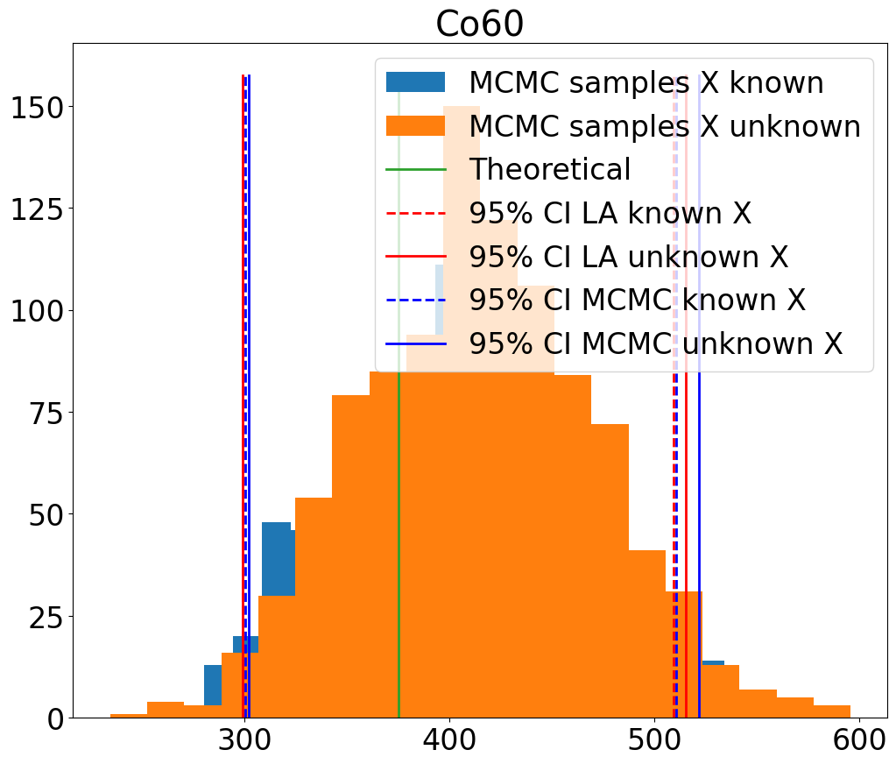

# Uncertainty quantification for gamma-spectrometry

This is the repo for uncertainty quantification methods for gamma-ray spectrometry.

The codes are organized as follows:
-  The Code folder contains the source code for the IAE and the uncertainty calculation by Fisher and MCMC:
      - Fisher when X is fixed: https://github.com/triem1998/Uncertainty_gamma/blob/ce832c11db09540c8264e866d42893bc54a17d04/codes/uncertainty.py#L70
-  The Data folder contains the dataset of 96 spectral signatures of 12 radionuclides as a function of steel thickness.
-  The Notebooks folder contains a jupyter notebook file for quantify the uncertainty
      - The Models folder contains the pre-trained IAE model.
## Package requirements
The codes are implemented using Pytorch and Pyro. To do it, you will need the packages listed in environment.yml. To create and activate a conda environment with all the imports needed, do:
-  conda env create -f environment.yml
-  conda activate pytorch
  
If there is a problem with the installation of Pytorch or Pyro, please follow this link to install it correctly: [Pytorch (Cuda or CPU)](https://pytorch.org/get-started/locally/), [Pyro](https://anaconda.org/conda-forge/pyro-ppl)

##  Test code
-  Run Uncertainty_gamma_spectrometry.ipynb if you want to see how to use the above codes to quantify the uncertainty.

        
